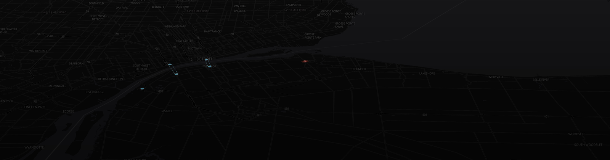
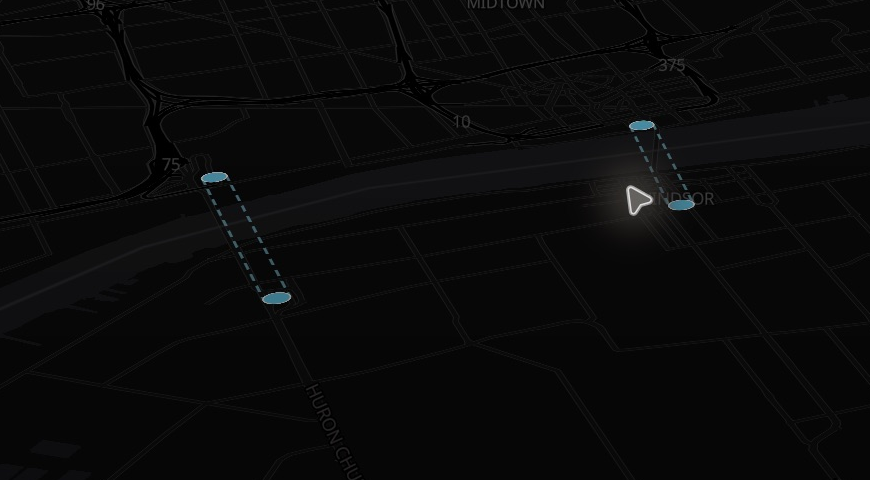
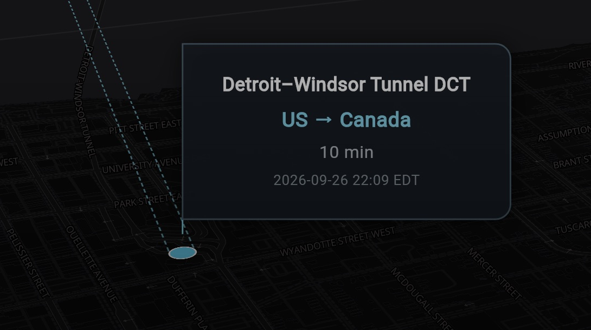
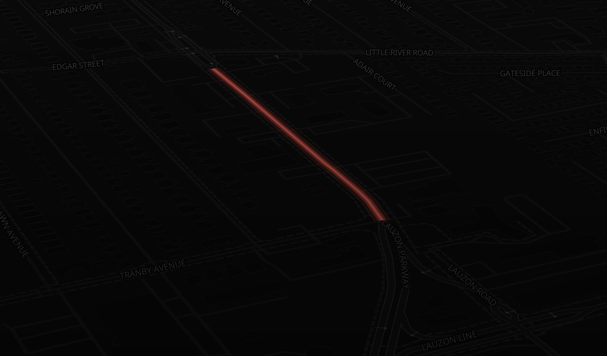

# Maple Crossing

A Flutter web map for exploring Windsor–Detroit border crossings. Maple Crossing combines a dark, pitched map with checkpoint markers, paired dashed crossing references, directional passenger wait times, and a branded launch screen.



*Map overview: checkpoint markers stay visible at wide zoom levels while detailed popovers appear from zoom 10. Images are screenshots of the development app, not mockups. Any wait values shown are historical examples from the capture session.*

## Contents

- [App tour](#app-tour)
- [Run locally](#run-locally)
- [Map controls and zoom behavior](#map-controls-and-zoom-behavior)
- [Crossings and wait times](#crossings-and-wait-times)
- [Project structure](#project-structure)
- [Customize the map](#customize-the-map)
- [Crossing data and imports](#crossing-data-and-imports)
- [Validation and deployment](#validation-and-deployment)
- [Troubleshooting](#troubleshooting)
- [Attribution and limitations](#attribution-and-limitations)

## App tour

### Border checkpoints and connections

The map displays Ambassador Bridge, Windsor Tunnel, and Gordie Howe International Bridge. Cyan circles sit at mapped inspection checkpoints rather than the international boundary in the river. Nearby checkpoints belonging to the same crossing and direction are combined into one marker.



Two parallel dashed cyan lines connect the paired U.S. and Canadian circles. These straight lines are visual references, not driving routes or surveyed border geometry. The circles remain flat against the pitched map. Their radii, outlines, and the dashed-line spacing grow with zoom.

The current local dataset supplies paired endpoints for Ambassador Bridge and Windsor Tunnel. Gordie Howe has one mapped Canadian endpoint, so no connecting line is drawn for it.

### Directional wait-time flags



*Close-up of the Windsor Tunnel flag at zoom 15 or higher. The displayed wait is a captured example, not a current reading.*

At zoom 10 and above, upright flag-style cards show the crossing name, travel direction, passenger-car wait, and provider update text. The connector meets the card's left edge. Cards and text grow together as you zoom in; overlapping or out-of-view cards are hidden to avoid clutter. The cards do not intercept map gestures.

A direction is shown only when its destination country is known. Otherwise, the card uses `US ↔ Canada` and does not select a directional wait.

### Road highlight and overlay



The red road highlight uses three animated line layers. The default geometry is a bundled Lauzon Road segment; the service can render other supplied road geometries with the same theme. The camera places the target around one quarter of the viewport height, leaving room for the darker lower overlay.


`MapOverlay` provides the fixed gradient and optional centered, softened text. Its text, size calculation, position, and feathering are editable in [overlay.dart](lib/components/overlay.dart). The placeholder message is presentation content, not a live map-loading status.

### Branded startup

The HTML launch screen uses a black background, the wide Maple Crossing logo, and a red progress animation at the top. It fades away after initial camera positioning, local crossing loading, and the map's first idle frame. Live wait-time fetching does not block launch. The road pulse starts after readiness so it cannot indefinitely postpone that idle frame.

The fade lasts 600 ms. Reduced-motion preferences disable the fade and loader animation. A connection hint appears after 45 seconds if startup is still pending.

## Run locally

Use a Flutter SDK compatible with the Dart constraint in [pubspec.yaml](pubspec.yaml): Dart `^3.12.2`. Chrome is the primary development target. Internet access is needed for map resources and published wait times; no API key is configured for these features.

```sh
flutter doctor
flutter pub get
flutter run -d chrome
```

If using FVM, run the same commands with `fvm flutter` and configure your editor to use that SDK.

### VS Code / Cursor

Install the recommended Dart and Flutter extensions, then open **Run and Debug** and select **Flutter Web (Chrome)**. Press **F5** to launch a debugger-managed instance.

| Action | How |
| --- | --- |
| Start | F5 / Run and Debug |
| Hot reload | Save a Dart file or run `Flutter: Hot Reload` |
| Hot restart | Run `Flutter: Hot Restart` |
| Stop | Stop button in the debug toolbar |
| Format Dart | Save; workspace settings enable whole-file formatting |

The committed `.vscode/settings.json` contains a developer-specific `dart.flutterSdkPath`. Change it to your installed SDK location, or remove that setting to use your normal Flutter installation.

HTML, JavaScript, and launch-screen changes require a browser reload. A static release preview must be rebuilt to reflect Dart edits; it does not support Flutter hot reload.

## Map controls and zoom behavior

Drag to pan, scroll to zoom, and right-drag to adjust pitch and bearing. There are no navigation buttons or header/footer controls; attribution remains on the map.

| Setting | Current behavior |
| --- | --- |
| Initial focus | Lauzon Road in Windsor, unless overridden |
| Initial zoom / pitch | 11.5 / 55° |
| Camera limits | Zoom 2–19; pitch up to 60° |
| Popover visibility | Hidden below zoom 10 |
| Popover scale | Smooth growth from 1× at zoom 11.5 to 1.8× at zoom 19 |
| Circle scale | 0.25× at zoom 8, 0.45× at 11.5, 1× at 15, 1.5× at 19 |
| Regular circle base radius | 14 logical pixels |
| Duplicate grouping | 350 m for known same-direction checkpoints; 60 m for unknown directions |

Native MapLibre camera expressions scale the circles and line spacing. Popup sizing is calculated from the current camera zoom and also respects system text scaling.

## Crossings and wait times

The bundled inventory is broader than the UI. `BorderCrossingService.visibleCrossingIds` restricts rendered circles, connections, and popovers to these crossings:

| Crossing | Local ID | Transit Barometer slug |
| --- | --- | --- |
| Windsor Tunnel | `road-061` | `windsor-and-detroit-tunnel` |
| Ambassador Bridge | `road-062` | `ambassador-bridge` |
| Gordie Howe International Bridge | `road-063` | `gordie-howe-international-bridge` |

[BorderWaitService](lib/services/border_wait_service.dart) fetches `https://transitbarometer.com/api/border.json` immediately and every 60 seconds. Each request has a 15-second timeout and a cache-busting query parameter. The response contains both directions; records are matched by exact slug.

- `into_us`: Canada → US.
- `into_canada`: US → Canada.
- Only the `cars` lane is displayed. Truck, NEXUS, pedestrian, and other lane waits are not implemented.
- A failed refresh retains the last successful feed. Failed refreshes or feed timestamps older than 15 minutes mark readings as last known.
- Per-direction update text comes from the provider. The feed generation timestamp and agency observation time can differ.

| Feed result | Popup label |
| --- | --- |
| Positive finite numeric delay | `N min` |
| Zero or negative delay | `No delay` |
| Closed status | `Closed` |
| Unknown / N/A status | `N/A` |
| Missing lane, direction, or numeric delay | `—` |

Waits are the agencies' latest published passenger delays distributed by Transit Barometer. Fetching every minute does not mean the agencies measure or publish every minute. These values are not route travel-time estimates or an operational guarantee.

## Project structure

```text
lib/
  main.dart                         Dark theme and app entry point
  components/
    overlay.dart                    Gradient and optional message
    border_popups.dart              Flag cards, zoom sizing, collision culling
  screens/map_screen.dart           Map, camera, readiness, layer composition
  services/
    border_crossing_service.dart    Local checkpoints, grouping, connections
    border_wait_service.dart        Feed refresh and directional normalization
    road_highlight_service.dart     Reusable pulsing road layers
    viewport_geohash_service.dart   Bounded viewport geohash coverage
  data/lauzon_road.dart              Default road geometry
  platform/                         Conditional launch-screen bridge
assets/
  data/                             Attributed local crossing JSON
  images/                           Maple Crossing logo assets
web/                                HTML launch screen and MapLibre setup
scripts/                            Data importers and importer tests
test/                               Flutter unit and widget tests
docs/images/                        README screenshots and image notes
.vscode/                            Shared editor and launch configuration
```

### Runtime flow

1. HTML displays the branded launch screen while Flutter initializes.
2. The app loads the local crossing snapshot and starts the wait-time service.
3. MapLibre loads the dark style; the camera focuses on the selected road.
4. Once camera, crossing data, and map idle are ready, the splash fades and the road pulse begins.
5. Camera changes update popup placement and schedule viewport geohash updates. Wait refreshes update the card contents separately.

## Customize the map

### Highlight another road

Supply a `LineString` to `MapScreen`. GeoJSON-style coordinates use **longitude, latitude** order:

```dart
final road = LineString(coordinates: [
  Position(-82.94447, 42.32524),
  Position(-82.94430, 42.32610),
]);

MapScreen(road: road, initialZoom: 14, initialPitch: 55)
```

Replacing `road` updates both the highlight and camera target. `initialCenter` can override the target. `RoadHighlightService` accepts a ticker provider and valid geometry, exposes `layers`, and supports `setRoad`, `pause`, `resume`, and `dispose`. It renders supplied geometry; it does not search for roads by name.

### Query the visible area

```dart
MapScreen(
  onViewportChanged: (area) {
    debugPrint('Precision: ${area.precision}; cells: ${area.hashes.length}');
    // Use area.hashes to query your own geographically indexed data.
  },
)
```

Camera updates are debounced for 150 ms. `ViewportGeohashService.cover(bounds)` defaults to precision 5 and a maximum of 256 cells, coarsening as needed for larger views. It handles wrapped longitudes and date-line crossings. Coverage is a bounding rectangle and may include offscreen areas for pitched or rotated views. Geohashes support application data queries; MapLibre handles its own tile selection.

### Add a crossing

Add or verify checkpoint coordinates in the local JSON, include its local ID in `visibleCrossingIds`, and add an exact feed slug to `BorderWaitService.slugs` if the provider supports it. Populate `destination_country` as `US` or `CA` only with a verified side assignment. A dashed connection requires both countries' endpoints. Hot restart to reload the local snapshot.

## Crossing data and imports

[us_canada_border_crossings.json](assets/data/us_canada_border_crossings.json) retains 213 inventory records and 238 imported checkpoint groups across 120 crossings. The application further filters and combines these into five displayed checkpoints at three Windsor–Detroit crossings.

The original crossing coordinates remain as reference data. Rendered markers use the `entrances` arrays and never fall back to those boundary coordinates. Each imported entrance retains its source node link, lane IDs, and coordinate provenance. Proximity matching and road access have not been fully verified.

To rebuild the inventory, download the source Wikipedia HTML first, then run:

```sh
python3 -m pip install beautifulsoup4
python3 scripts/import_border_crossings.py source.html assets/data/us_canada_border_crossings.json
python3 scripts/import_border_entrances.py assets/data/us_canada_border_crossings.json checkpoints.json
```

A third input file can validate membership in highway ways:

```sh
python3 scripts/import_border_entrances.py assets/data/us_canada_border_crossings.json checkpoints.json checkpoint_roads.json
```

Overpass query for `checkpoints.json`:

```text
[out:json][timeout:150];
(node["barrier"="border_control"](41,-126,50,-66);
 node["barrier"="border_control"](54,-142,70,-129););
out;
```

For `checkpoint_roads.json`, replace `out;` with `way(bn)["highway"];out body;`. The importer groups adjacent lanes within 60 m and associates checkpoints with the nearest listed road crossing within 5 km, or 35 km above latitude 59°.

**Review regenerated data before using it.** Rebuilding the original inventory removes entrance enrichment. Existing direction metadata is preserved by the entrance importer only when it remains in its input and the representative OSM node still matches. Retain and reapply reviewed direction assignments when rebuilding from scratch.

## Validation and deployment

```sh
flutter analyze
flutter test
python3 scripts/test_border_entrances.py
flutter build web --no-wasm-dry-run
python3 -m http.server 8080 --bind 127.0.0.1 --directory build/web
```

Open `http://localhost:8080` for the release preview. Tests cover road updates, viewport geohashes, launch readiness, crossing filtering/grouping, paired connections, popup content, and wait normalization/failure handling.

Deploy the contents of `build/web` to a static host. For a subdirectory deployment, build with the appropriate `--base-href /your-path/`. The host/browser must allow access to MapLibre's CDN resources, OpenFreeMap styles/tiles, and Transit Barometer. If the wait provider removes cross-origin support, a same-origin proxy will be needed.

Android, iOS, and Linux scaffolding is present, but the current experience has been validated primarily on the web. Do not assume native builds have equivalent integration coverage.

## Troubleshooting

| Symptom | Check |
| --- | --- |
| No popovers | Zoom to at least 10; overlapping and offscreen cards are also culled. |
| Wait shows `—` | Confirm the exact slug, destination country, and passenger lane exist in the feed. |
| Last-known label | Check network access, feed generation time, and the latest refresh result. |
| No Gordie Howe connection | The bundled data currently has only one mapped endpoint. |
| Old appearance after editing | Use Flutter hot reload for Dart; rebuild a static preview and hard-refresh its browser tab. |
| Launch screen stays visible | Check CDN/style requests, network access, browser console, and first-idle readiness. |
| Formatter or debugger missing | Install Dart/Flutter extensions and correct the workspace SDK path. |
| Overlay message is absent or oversized | Inspect the current `_fontSize` calculation and text in `MapOverlay`; keep returned font sizes and blur values nonnegative. |

## Attribution and limitations

- Basemap: [OpenFreeMap](https://openfreemap.org/), OpenMapTiles, and [OpenStreetMap contributors](https://www.openstreetmap.org/copyright).
- Crossing inventory: [Wikipedia's Canada–United States crossing list](https://en.wikipedia.org/wiki/List_of_Canada%E2%80%93United_States_border_crossings), Wikipedia contributors, CC BY-SA 4.0.
- Checkpoint coordinates: OpenStreetMap contributors, ODbL 1.0; individual source links are stored in the JSON.
- Published waits: [Transit Barometer](https://transitbarometer.com/border-barometer/), using CBSA/CBP source information.

Map screenshots in this README retain these credits through their captions and this attribution section. See [image notes](./docs/images/README.md) for capture details.

The wider inventory includes historical/restricted entries and is not a verified exhaustive list. Ferry coverage is absent. Marker presence does not establish current operating status or permission to cross. The dashed references are not navigable routes. There is no live GTFS layer or custom 3D building renderer in the current app. The optional, unused geographic source download under `assets/planet/` is ignored by Git and not bundled.
